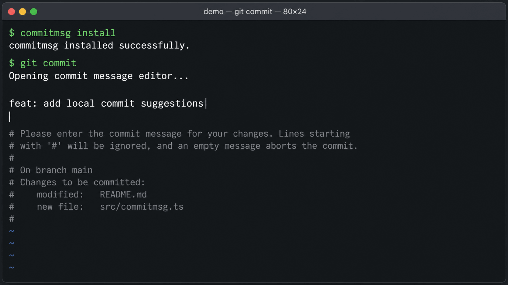

# commitmsg

Local, no-API-key Git commit-message suggestions powered entirely by an Ollama model running on your laptop.

[](https://github.com/laurenp-2/commitmsg/actions/workflows/ci.yml)



## Install

```sh
go install github.com/laurenp-2/commitmsg@latest
```

## Versioning

`commitmsg version` reads the module version embedded by the Go toolchain. An
install from a release tag reports that exact tag:

```sh
go install github.com/laurenp-2/commitmsg@v0.1.0
commitmsg version # commitmsg v0.1.0
```

Locally built development binaries preserve Go's build metadata, such as a
pseudo-version or `v0.1.0+dirty`. When no module version is available, they
report `devel` along with a short commit revision when Go makes it available.
To release a new version, create and push the semver tag; there is no source
version constant to update.

## Quick start

```sh
ollama pull qwen2.5-coder:7b
commitmsg install
```

Stage changes and run `git commit` as usual. The editor opens with a suggested
message at the top. To print suggestions instead, run `commitmsg`.

## Flags

| Flag | Default | Description |
| --- | --- | --- |
| `--model` | `qwen2.5-coder:7b` | Ollama model to use; also reads `COMMITMSG_MODEL`. |
| `-n` | `1` | Number of suggestions to print. |
| `--host` | `http://localhost:11434` | Ollama base URL; also reads `OLLAMA_HOST`. |
| `--max-chars` | `12000` | Character budget for the staged diff. |
| `--temperature` | `0.2` | Sampling temperature. |
| `--body` | `false` | Include a short explanatory body. |
| `--timeout` | `60s` | Timeout for each Ollama request. |
| `--verbose` | `false` | Print the prompt and request timing to stderr. |

Use `commitmsg install [--force]` to install the `prepare-commit-msg` hook,
and `commitmsg uninstall` to remove only a hook installed by commitmsg.

## How it works

`commitmsg` reads only the staged diff. It always gives the model a compact
file summary, skips lockfiles, generated files, and binaries, then budgets the
remaining diff by the logarithm of each file's changed-line count. Large files
therefore cannot starve small, meaningful edits. When a file must be shortened,
whole diff hunks are retained rather than cutting through a hunk.

The tool talks only to the local Ollama server; no source code or API key leaves
your machine. The installed hook fails open, so an unavailable model never blocks
a normal `git commit`.

## License

[MIT](LICENSE) © Lauren Pothuru
